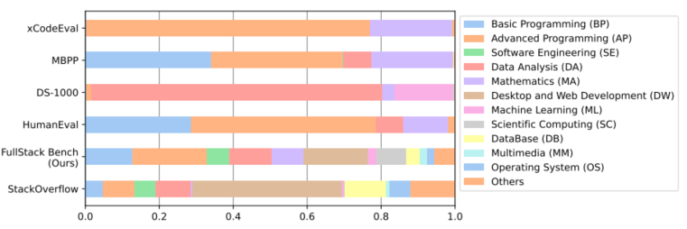
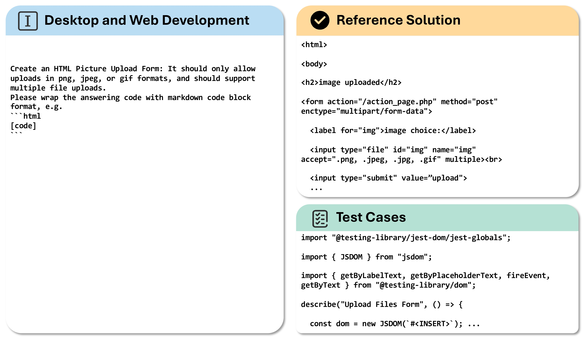
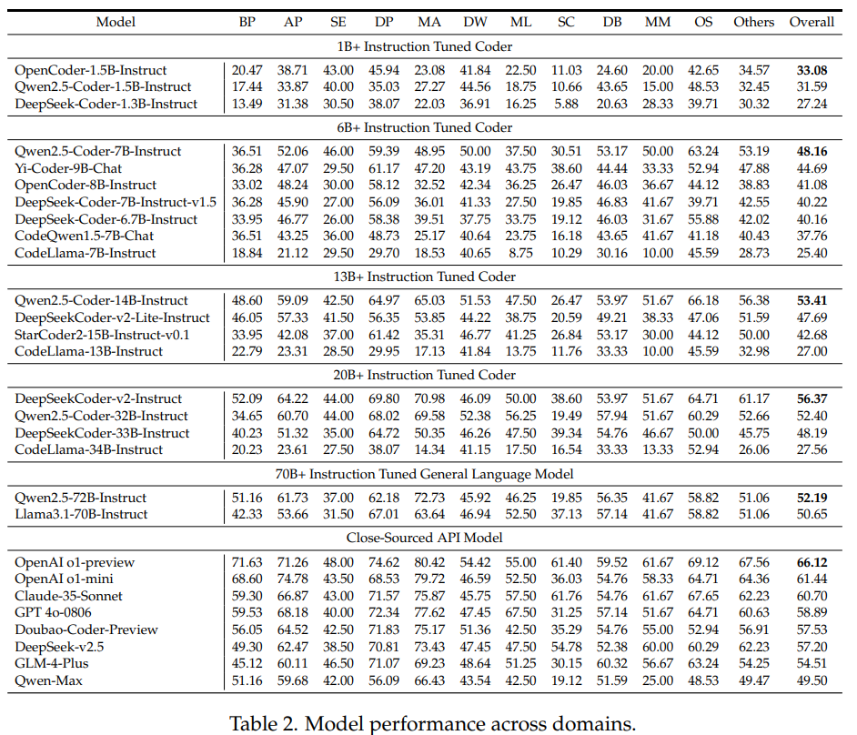
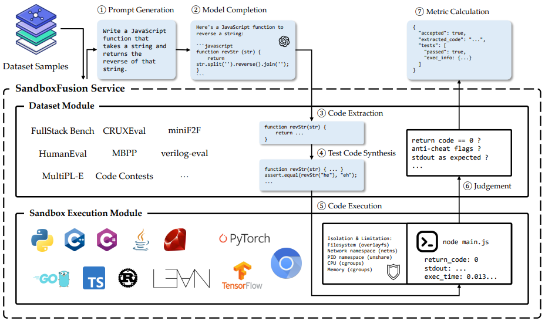

<h1 style="text-align: center;">FullStack Bench: Evaluating LLMs as Full Stack Coders </h1>

<div align="center" style="margin: 2px;">
    <a href="https://www.python.org/">
        
    </a>
  <a href="" style="margin: 2px;">
    
  </a>
  <a href="" style="margin: 2px;">
    
  </a>
</div>

<div style="text-align: center;">
Official repository for our paper "FullStack Bench: Evaluating LLMs as Full Stack Coders"
</div>

<p align="center">
    <a href="https://github.com/bytedance/FullStackBench">🏠 FullStack Bench Code </a> •
    <a href="https://huggingface.co/datasets/ByteDance/FullStackBench">📊 Benchmark Data </a> •
    <a href="https://github.com/bytedance/SandboxFusion">📚 SandboxFusion </a> 
</p>

## Table of contents
- [FullStack Bench: Evaluating LLMs as Full Stack Coders](#Introduction)
  - [📌 Introduction](#introduction)
  - [📚 SandboxFusion](#leaderboard)
  - [📊 Data](#data)
  - [💻 Usage](#usage)
  - [📖 Citation](#citation)

## 📌Introduction
**FullStack Bench** is a multilingual benchmark for full-stack programming, covering  a wide range of application domains and **16** programming languages with **3K** test samples, which substantially pushes the limits of code LLMs in code-related abilities of the real-world code development scenarios.
<p align="center">

</p>

### Task Examples
**FullStack Bench** covers more mainstream application domains when compared to existing code
evaluation benchmarks. Here is a visualization example from FullStack Bench, where the model is tasked with solving problems in the domain of desktop and web development using HTML.
<p align="center">

</p>

Refer to our paper or dataset for more details. 

### Results
<p align="center">

</p>
Refer to our paper for more results.

## 📚SandboxFusion
**SandboxFusion** is an an effective code sandbox execution tool to evaluate different programming tasks from different languages. It incorporates over 10 coding-related evaluation datasets, featuring a standardized data format and accessible via a uniform HTTP API.
<p align="center">

</p>
Refer to our paper and <a href="https://bytedance.github.io/SandboxFusion/">📚 Tutorial </a> for more Details.

## 📊Data
<div align="center">

| **Dataset** |  **Download** |
| :------------: | :------------: |
| FullStack Bench Dataset  | [🤗 HuggingFace](https://github.com/bytedance/FullStackBench)   |

</div>

## 💻Usage
Start the [sandbox server](https://bytedance.github.io/SandboxFusion/):

```bash
docker run -d --rm -p 8080:8080 volcengine/sandbox-fusion:server-20241204
```

For users in mainland China, the following mirror is provided:

```bash
docker run -d --rm -p 8080:8080 vemlp-cn-beijing.cr.volces.com/preset-images/code-sandbox:server-20241204
```

Then, run the benchmark:

```bash
git clone https://github.com/bytedance/FullStackBench.git
cd FullStackBench
pip install -r requirements.txt
# modify the model configs in src/main.py
python src/main.py
```
## 📖Citation
If you find our work helpful, please use the following citations.
```
@misc{liu2024fullstackbenchevaluatingllms,
      title={FullStack Bench: Evaluating LLMs as Full Stack Coders}, 
      author={Siyao Liu and He Zhu and Jerry Liu and Shulin Xin and Aoyan Li and Rui Long and Li Chen and Jack Yang and Jinxiang Xia and Z. Y. Peng and Shukai Liu and Zhaoxiang Zhang and Ge Zhang and Wenhao Huang and Kai Shen and Liang Xiang},
      year={2024},
      eprint={2412.00535},
      archivePrefix={arXiv},
      primaryClass={cs.AI},
      url={https://arxiv.org/abs/2412.00535}, 
}
```